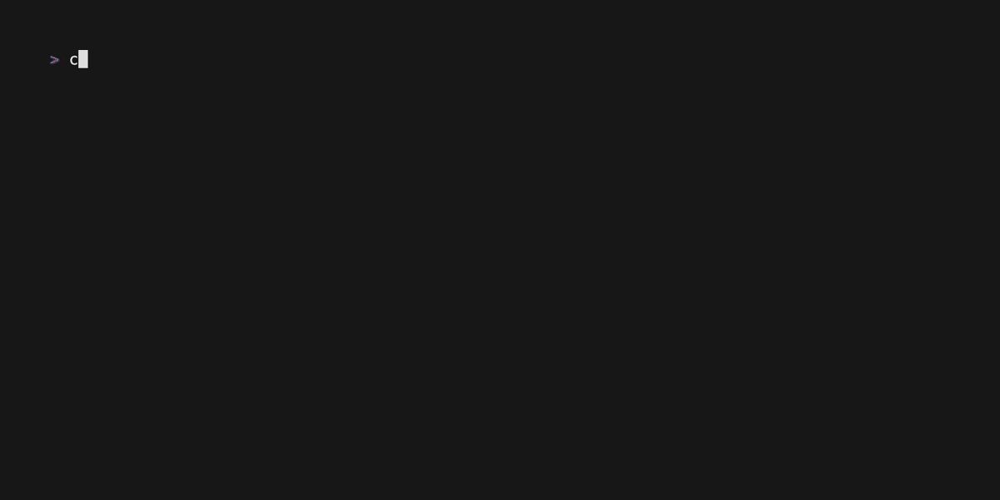

# gegen [](https://github.com/benjaminjellis/gegen/actions/workflows/release.yml)

`gegen` is a TUI for finding livescores and fixtures from football competitions around the world. Named after gegenpressing (because it was the first football term that came to mind when I needed a name), `gegen` is cross platform and should work in most terminals.

## Demo


## Installation

### from crates.io (requires a rust toolchain)

`gegen` can be installed from crates.io by running 

```
cargo install gegen
```

### from source (requires a rust toolchain)

cloning this repository and running the below will create a binary called `gegen` in `target/release`

```shell
cargo run --release
```


## Logs

`gegen` write logs to disk for help with debugging. These logs are the only things that `gegen` writes to disk and they can be found in the following locations:

- Mac: `$HOME/Library/Application Support/gegen/logs`
- Linux: `$XDG_DATA_HOME/gegen/logs` or `$HOME/.local/share/gegen/logs`
- Windows: `{FOLDERID_LocalAppData}\gegen\logs`

### Generating demo gifs

[vhs](https://github.com/charmbracelet/vhs) files are defined in `.vhs` and can be used to generate demo gifs

```shell
vhs .vhs/demo.tape
```

